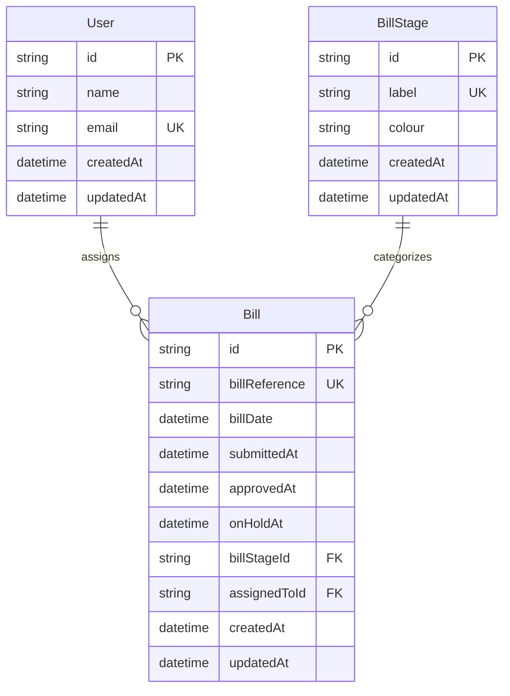

# System Architecture

This document provides a comprehensive overview of the Trilogy Care Bill Management System architecture, including technology stack, database design, and component organization.

## Technology Stack

### Frontend
- **Next.js 15.5.2**: React framework with App Router for modern web development
- **React 19.1.0**: Component-based UI library with hooks and context
- **TypeScript 5**: Static typing for improved developer experience and code quality
- **Tailwind CSS v4**: Utility-first CSS framework for rapid UI development
- **@tailwindcss/postcss**: PostCSS integration for Tailwind CSS

### Backend
- **Next.js API Routes**: Server-side API endpoints using App Router conventions
- **Prisma ORM 6.16.2**: Type-safe database client and schema management
- **SQLite**: Lightweight, file-based database for development and testing
- **Server Actions**: Server-side business logic with `'use server'` directives

### Development & Testing
- **Jest 30.1.3**: JavaScript testing framework with multi-project configuration
- **React Testing Library 16.3.0**: Component testing utilities
- **Playwright 1.51.1**: End-to-end testing framework
- **ESLint 9**: Code linting and formatting
- **TypeScript 5**: Type checking and compilation
- **Supertest 7.1.4**: HTTP integration testing

## Project Structure

```
├── app/                          # Next.js App Router
│   ├── api/                     # API route handlers
│   │   ├── bills/              # Bill-related endpoints
│   │   │   ├── route.ts       # GET /api/bills
│   │   │   └── assign/        # POST /api/bills/assign
│   │   ├── users/             # GET /api/users
│   │   └── health/            # GET /api/health
│   ├── bills/                  # Bills pages and actions
│   │   ├── page.tsx           # Bills dashboard
│   │   ├── new/               # New bill form
│   │   └── actions.ts         # Server actions
│   ├── lib/                    # Shared utilities
│   │   ├── prisma.ts          # Prisma client singleton
│   │   ├── data.ts            # Data access functions
│   │   ├── validation.ts      # Input validation
│   │   ├── error-constants.ts # Error definitions
│   │   └── definitions.ts     # Type definitions
│   ├── ui/                     # UI components
│   │   ├── bills/             # Bill-specific components
│   │   ├── dashboard/         # Dashboard components
│   │   └── skeletons.tsx      # Loading skeletons
│   ├── layout.tsx             # Root layout component
│   ├── page.tsx               # Homepage
│   └── globals.css            # Global styles
├── lib/                        # Root-level utilities
│   ├── cache.ts               # Caching utilities
│   ├── monitoring.ts          # Performance monitoring
│   └── database-constraints.ts # Database constraint logic
├── prisma/                     # Database configuration
│   ├── schema.prisma          # Database schema definition
│   ├── seed.ts                # Database seeding script
│   └── migrations/            # Database migrations
├── __tests__/                  # Test suites
│   ├── api/                   # Unit tests (mocked)
│   ├── integration/           # Integration tests (real DB)
│   ├── unit/                  # Frontend component tests
│   └── e2e/                   # End-to-end tests
└── docs/                       # Documentation
    ├── api/                   # API reference
    ├── architecture/          # System architecture
    ├── deployment/            # Setup instructions
    ├── examples/              # Code examples
    ├── getting-started/       # Quick start guide
    └── guides/                # Advanced guides
```

## Database Architecture

### Schema Design

The database uses a relational model with three core entities:



### Entity Relationships

**User → Bill (One-to-Many)**
- A user can be assigned multiple bills
- Bills can be unassigned (assignedToId = null)
- Business rule: Maximum 3 bills per user

**BillStage → Bill (One-to-Many)**
- Each bill belongs to exactly one stage
- Stages define workflow progression
- 7 predefined stages: Draft, Submitted, Approved, Paying, On Hold, Rejected, Paid

### Data Constraints

- **Unique Constraints**: User email, Bill reference
- **Foreign Keys**: Bill.assignedToId → User.id, Bill.billStageId → BillStage.id
- **Business Rules**: 3-bill assignment limit, stage-based assignment restrictions

## Frontend Architecture

### Component Structure

**Page Components**
- `app/page.tsx`: Homepage with navigation
- `app/bills/page.tsx`: Bills dashboard with Kanban view
- `app/bills/new/page.tsx`: Bill creation form

**Layout System**
- `app/layout.tsx`: Root layout with fonts and global styles
- Responsive design using Tailwind CSS grid system
- Mobile-first responsive breakpoints

### State Management

**Client-Side State**
- React hooks (useState, useEffect) for component state
- No global state management (Redux/Zustand) - kept simple
- Server state synchronized via API calls

**Data Flow**
1. Components fetch data from API endpoints
2. Local state updates trigger re-renders
3. User actions call API endpoints
4. Optimistic updates for better UX

### UI Patterns

**Design System**
- Consistent color palette with semantic colors
- Tailwind utility classes for spacing and typography
- Component composition over inheritance
- Accessibility considerations with semantic HTML

## Backend Architecture

### API Design

**RESTful Endpoints**
- Resource-based URLs (`/api/users`, `/api/bills`)
- Standard HTTP methods (GET, POST)
- JSON request/response format
- Consistent error handling

**Business Logic Layer**
- Validation in API route handlers
- Database operations through Prisma ORM
- Error handling with appropriate HTTP status codes

### Database Layer

**Prisma ORM Integration**
- Type-safe database queries
- Automatic migration generation
- Connection pooling and optimization
- Development/production environment handling

**Singleton Pattern**
```typescript
// lib/prisma.ts - Prevents connection leaks
export const prisma = globalForPrisma.prisma ?? new PrismaClient()
```

## Security Considerations

### Data Validation
- Input validation on all API endpoints
- TypeScript type checking for compile-time safety
- Prisma schema validation for runtime safety

### Database Security
- Foreign key constraints prevent orphaned records
- Unique constraints prevent duplicate data
- No direct SQL injection vectors (ORM-based queries)

### Authentication & Authorization
- Currently no authentication implemented (development/demo purposes)
- Ready for authentication middleware integration
- API endpoints designed for role-based access control

## Performance Considerations

### Database Optimization
- Indexed fields for faster queries (id, email, billReference)
- Efficient joins using Prisma includes
- Connection pooling for concurrent requests

### Frontend Optimization
- Next.js automatic code splitting
- Static asset optimization
- Component-level loading states
- Turbopack for faster development builds

### Caching Strategy
- Browser caching for static assets
- No server-side caching implemented (suitable for current scale)
- API responses designed for client-side caching

## Scalability Design

### Current Architecture Benefits
- Stateless API design enables horizontal scaling
- Database-agnostic ORM (Prisma) supports migration
- Component-based frontend supports incremental updates
- Comprehensive testing enables confident refactoring

### Future Scaling Considerations
- Database migration path (SQLite → PostgreSQL/MySQL)
- API rate limiting and authentication
- CDN integration for static assets
- Microservices decomposition potential

## Development Patterns

### Code Organization
- Domain-driven folder structure
- Separation of concerns (UI, API, Database)
- TypeScript interfaces for type safety
- Consistent naming conventions

### Error Handling
- Fail-fast approach with meaningful exceptions
- Consistent error response format across APIs
- Client-side error boundaries for graceful degradation

### Testing Strategy
- Multi-layer testing approach (unit, integration, e2e)
- Real database testing for critical business logic
- Component testing for UI reliability
- API testing for endpoint validation

## Configuration Management

### Environment Configuration
- Development vs production settings
- Database URL configuration
- Build optimization settings (Turbopack)

### Deployment Architecture
- Static file generation capability
- API routes as serverless functions
- Database migration strategy
- Environment variable management

This architecture provides a solid foundation for a bill management system while maintaining simplicity and enabling future growth.