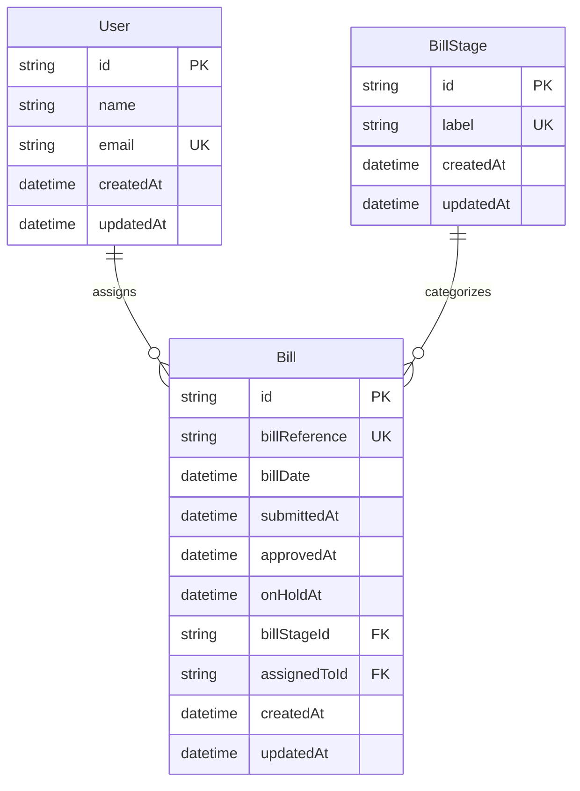

# Database Architecture

[← Back to Documentation](../README.md) | [Components](components.md) | [API Reference](../reference/api.md)

This document provides comprehensive documentation for the database architecture, including schema design, constraints, triggers, and performance optimization for the Bill Management System.

## Overview

The system uses SQLite with Prisma ORM and implements a multi-layer defense strategy for business rule enforcement. The database architecture ensures data integrity through a combination of schema constraints, triggers, views, and application-level validation.

## Schema Design

### Entity Relationship Diagram



### Core Entities

#### User Table
```sql
CREATE TABLE users (
    id TEXT PRIMARY KEY DEFAULT (lower(hex(randomblob(4))) || '-' || lower(hex(randomblob(2))) || '-4' || substr(lower(hex(randomblob(2))),2) || '-' || substr('89ab',abs(random()) % 4 + 1, 1) || substr(lower(hex(randomblob(2))),2) || '-' || lower(hex(randomblob(6)))),
    name TEXT NOT NULL,
    email TEXT NOT NULL UNIQUE,
    created_at DATETIME NOT NULL DEFAULT CURRENT_TIMESTAMP,
    updated_at DATETIME NOT NULL DEFAULT CURRENT_TIMESTAMP
);
```

**Key Features:**
- Unique email constraint
- Automatic timestamps
- One-to-many relationship with bills

#### BillStage Table
```sql
CREATE TABLE bill_stages (
    id TEXT PRIMARY KEY DEFAULT (lower(hex(randomblob(4))) || '-' || lower(hex(randomblob(2))) || '-4' || substr(lower(hex(randomblob(2))),2) || '-' || substr('89ab',abs(random()) % 4 + 1, 1) || substr(lower(hex(randomblob(2))),2) || '-' || lower(hex(randomblob(6)))),
    label TEXT NOT NULL UNIQUE,
    created_at DATETIME NOT NULL DEFAULT CURRENT_TIMESTAMP,
    updated_at DATETIME NOT NULL DEFAULT CURRENT_TIMESTAMP
);
```

**Predefined Stages:**
- Draft, Submitted, Approved, Paying, On Hold, Rejected, Paid

#### Bill Table
```sql
CREATE TABLE bills (
    id TEXT PRIMARY KEY DEFAULT (lower(hex(randomblob(4))) || '-' || lower(hex(randomblob(2))) || '-4' || substr(lower(hex(randomblob(2))),2) || '-' || substr('89ab',abs(random()) % 4 + 1, 1) || substr(lower(hex(randomblob(2))),2) || '-' || lower(hex(randomblob(6)))),
    bill_reference TEXT NOT NULL UNIQUE,
    bill_date DATETIME NOT NULL,
    submitted_at DATETIME,
    approved_at DATETIME,
    on_hold_at DATETIME,
    bill_stage_id TEXT NOT NULL REFERENCES bill_stages(id) ON DELETE RESTRICT ON UPDATE CASCADE,
    assigned_to_id TEXT REFERENCES users(id) ON DELETE SET NULL ON UPDATE CASCADE,
    created_at DATETIME NOT NULL DEFAULT CURRENT_TIMESTAMP,
    updated_at DATETIME NOT NULL DEFAULT CURRENT_TIMESTAMP
);
```

**Key Features:**
- Unique bill reference constraint
- Foreign key relationships with cascade rules
- Optional timestamps for workflow stages
- Nullable assigned_to_id for unassigned bills

## Multi-Layer Defense Strategy

The system implements a comprehensive defense-in-depth approach for business rule enforcement:

```
┌─────────────────────────────────────────────────────────────────────────────┐
│                           USER INTERFACE LAYER                              │
│  • Form validation (client-side)                                            │
│  • Real-time feedback                                                       │
│  • User-friendly error messages                                             │
└─────────────────────────────────────────────────────────────────────────────┘
                                        │
                                        ▼
┌─────────────────────────────────────────────────────────────────────────────┐
│                        APPLICATION BUSINESS LAYER                          │
│  • Server Actions (createBill, assignBillAction)                         │
│  • Business rule validation                                               │
│  • Performance optimization (caching)                                     │
│  • Complex workflows (stage transitions)                                  │
│  • Monitoring and alerting                                                │
└─────────────────────────────────────────────────────────────────────────────┘
                                        │
                                        ▼
┌─────────────────────────────────────────────────────────────────────────────┐
│                           DATABASE LAYER                                   │
│  • Atomic constraint enforcement (triggers)                              │
│  • Final safety net                                                       │
│  • Race condition prevention                                              │
│  • Data integrity guarantee                                               │
└─────────────────────────────────────────────────────────────────────────────┘
```

## Business Rules

### Active vs Inactive Bill Stages

**Active Stages** (count toward 3-bill limit):
- Draft
- Submitted  
- Approved
- Paying
- On Hold

**Inactive Stages** (don't count toward limit):
- Rejected
- Paid

### 3-Bill Limit Rule

Each user can have a maximum of 3 bills assigned in active stages at any given time. Bills in inactive stages (Rejected, Paid) do not count toward this limit.

## Database Constraints and Triggers

### SQLite Triggers

The database includes four triggers that enforce the 3-bill limit at the database level:

#### 1. Insert Constraint (`check_bill_limit_insert`)
```sql
CREATE TRIGGER IF NOT EXISTS check_bill_limit_insert
BEFORE INSERT ON bills
WHEN NEW.assigned_to_id IS NOT NULL
BEGIN
  SELECT CASE
    WHEN (
      SELECT COUNT(*)
      FROM bills b
      JOIN bill_stages bs ON b.bill_stage_id = bs.id
      WHERE b.assigned_to_id = NEW.assigned_to_id
        AND bs.label IN ('Draft', 'Submitted', 'Approved', 'Paying', 'On Hold')
    ) >= 3
    THEN RAISE(ABORT, 'User already has 3 bills assigned in active stages')
  END;
END;
```

**When it triggers:** Before inserting a new bill with an assigned user  
**What it checks:** Counts existing bills in active stages for the target user

#### 2. Assignment Constraint (`check_bill_limit_update`)
```sql
CREATE TRIGGER IF NOT EXISTS check_bill_limit_update
BEFORE UPDATE ON bills
WHEN NEW.assigned_to_id IS NOT NULL
  AND OLD.assigned_to_id IS NULL
BEGIN
  SELECT CASE
    WHEN (
      SELECT COUNT(*)
      FROM bills b
      JOIN bill_stages bs ON b.bill_stage_id = bs.id
      WHERE b.assigned_to_id = NEW.assigned_to_id
        AND bs.label IN ('Draft', 'Submitted', 'Approved', 'Paying', 'On Hold')
    ) >= 3
    THEN RAISE(ABORT, 'User already has 3 bills assigned in active stages')
  END;
END;
```

**When it triggers:** Before updating a bill to assign it to a user (from unassigned to assigned)

#### 3. Reassignment Constraint (`check_bill_limit_reassign`)
```sql
CREATE TRIGGER IF NOT EXISTS check_bill_limit_reassign
BEFORE UPDATE ON bills
WHEN NEW.assigned_to_id IS NOT NULL
  AND OLD.assigned_to_id IS NOT NULL
  AND NEW.assigned_to_id != OLD.assigned_to_id
BEGIN
  SELECT CASE
    WHEN (
      SELECT COUNT(*)
      FROM bills b
      JOIN bill_stages bs ON b.bill_stage_id = bs.id
      WHERE b.assigned_to_id = NEW.assigned_to_id
        AND bs.label IN ('Draft', 'Submitted', 'Approved', 'Paying', 'On Hold')
    ) >= 3
    THEN RAISE(ABORT, 'Target user already has 3 bills assigned in active stages')
  END;
END;
```

**When it triggers:** Before reassigning a bill from one user to another

#### 4. Stage Transition Constraint (`check_bill_limit_stage_transition`)
```sql
CREATE TRIGGER IF NOT EXISTS check_bill_limit_stage_transition
BEFORE UPDATE ON bills
WHEN OLD.bill_stage_id != NEW.bill_stage_id
  AND NEW.assigned_to_id IS NOT NULL
BEGIN
  SELECT CASE
    WHEN (
      SELECT COUNT(*)
      FROM bills b
      JOIN bill_stages bs ON b.bill_stage_id = bs.id
      WHERE b.assigned_to_id = NEW.assigned_to_id
        AND bs.label IN ('Draft', 'Submitted', 'Approved', 'Paying', 'On Hold')
    ) >= 3
    THEN RAISE(ABORT, 'User already has 3 bills assigned in active stages')
  END;
END;
```

**When it triggers:** Before changing a bill's stage when it's assigned to a user

### Database Views

The system includes optimized views for performance:

#### User Assignment Capacity View
```sql
CREATE VIEW IF NOT EXISTS user_assignment_capacity AS
SELECT 
  u.id as user_id,
  u.name as user_name,
  u.email as user_email,
  COALESCE(COUNT(b.id), 0) as current_assigned_count,
  (3 - COALESCE(COUNT(b.id), 0)) as available_slots,
  CASE 
    WHEN COALESCE(COUNT(b.id), 0) >= 3 THEN 'FULL' 
    WHEN COALESCE(COUNT(b.id), 0) >= 2 THEN 'NEARLY_FULL'
    ELSE 'AVAILABLE' 
  END as capacity_status
FROM users u
LEFT JOIN bills b ON u.id = b.assigned_to_id 
  AND b.bill_stage_id IN (
    SELECT id FROM bill_stages 
    WHERE label IN ('Draft', 'Submitted', 'Approved', 'Paying', 'On Hold')
  )
GROUP BY u.id, u.name, u.email;
```

#### User Bill Counts View
```sql
CREATE VIEW IF NOT EXISTS user_bill_counts AS
SELECT 
  u.id as user_id,
  u.name as user_name,
  u.email as user_email,
  COALESCE(bill_counts.bill_count, 0) as bill_count,
  CASE 
    WHEN COALESCE(bill_counts.bill_count, 0) >= 3 THEN 1 
    ELSE 0 
  END as has_reached_limit,
  CASE 
    WHEN COALESCE(bill_counts.bill_count, 0) >= 3 THEN 0 
    ELSE 3 - COALESCE(bill_counts.bill_count, 0) 
  END as remaining_slots
FROM users u
LEFT JOIN (
  SELECT 
    assigned_to_id,
    COUNT(*) as bill_count
  FROM bills 
  WHERE assigned_to_id IS NOT NULL
    AND bill_stage_id IN (
      SELECT id FROM bill_stages 
      WHERE label IN ('Draft', 'Submitted', 'Approved', 'Paying', 'On Hold')
    )
  GROUP BY assigned_to_id
) bill_counts ON u.id = bill_counts.assigned_to_id;
```

## Application-Level Integration

### Server Actions Implementation

The application layer enforces business rules through Server Actions in `app/bills/actions.ts`:

```typescript
async function validateUserCapacity(userId: string): Promise<void> {
  const userBillCount = await prisma.bill.count({
    where: { assignedToId: userId }
  })

  if (!canUserAcceptMoreBills(userBillCount)) {
    throw createError(BillAssignmentError.USER_BILL_LIMIT_EXCEEDED)
  }
}
```

### Multi-Layer Benefits

**Database Triggers:**
- ✅ Prevent data corruption at the lowest level
- ✅ Work even if application logic is bypassed
- ✅ Provide atomic enforcement within transactions
- ✅ Handle edge cases and race conditions

**Application Logic:**
- ✅ Better error messages and user experience
- ✅ Performance optimization with caching
- ✅ Complex business workflows
- ✅ Integration with monitoring and logging

## Performance Optimization

### Indexing Strategy

The database includes optimized indexes for common query patterns:

```sql
-- Core indexes
CREATE INDEX idx_bills_assigned_stage ON bills(assigned_to_id, bill_stage_id) 
WHERE assigned_to_id IS NOT NULL;

CREATE INDEX idx_bills_assignable ON bills(id, bill_stage_id) 
WHERE assigned_to_id IS NULL 
  AND bill_stage_id IN (
    SELECT id FROM bill_stages WHERE label IN ('Draft', 'Submitted')
  );

-- Additional performance indexes
CREATE INDEX idx_bills_stage_id ON bills(bill_stage_id);
CREATE INDEX idx_bills_assigned_to_id ON bills(assigned_to_id);
CREATE INDEX idx_bills_reference ON bills(bill_reference);
CREATE INDEX idx_bills_date ON bills(bill_date);
```

### Query Optimization

The system uses efficient query patterns:

```typescript
// Optimized user capacity check
const userBillCount = await prisma.bill.count({
  where: { 
    assignedToId: userId,
    billStage: {
      label: { in: ['Draft', 'Submitted', 'Approved', 'Paying', 'On Hold'] }
    }
  }
})

// Efficient bill fetching with relationships
const bills = await prisma.bill.findMany({
  include: {
    assignedTo: {
      select: { id: true, name: true, email: true }
    },
    billStage: {
      select: { id: true, label: true }
    }
  },
  orderBy: { createdAt: 'desc' }
})
```

## Migration Strategy

### Database Setup

The database constraints are automatically applied during setup:

```bash
# Automatic setup (recommended)
npm run db:setup

# Manual setup
npx prisma db push      # Applies schema + triggers
npm run db:seed         # Adds sample data
```

### Migration File Structure

```
prisma/migrations/20251007060826_initial_with_corrected_constraints/
├── migration.sql    # Prisma-generated schema (tables, indexes, foreign keys)
└── triggers.sql     # Custom SQLite triggers (applied post-migration)
```

**Important**: Prisma doesn't support custom SQLite triggers in `schema.prisma`, so triggers are maintained separately in `triggers.sql` and applied after migrations using `prisma db execute`.

### Separation of Concerns

- **Prisma Schema** (`schema.prisma`): Defines models, relationships, indexes
- **Prisma Migration** (`migration.sql`): Auto-generated from schema
- **Custom Triggers** (`triggers.sql`): Manually maintained business logic

This separation ensures:
- Prisma can regenerate migrations without losing custom triggers
- Clear distinction between ORM-managed and custom database logic
- Triggers can be updated independently of schema changes

## Monitoring and Maintenance

### Database-Level Monitoring

```sql
-- Monitor trigger violations
SELECT * FROM sqlite_master WHERE type = 'trigger' AND name LIKE 'check_bill_limit%';

-- Check constraint status
SELECT name, sql FROM sqlite_master WHERE type = 'trigger';
```

### Application-Level Monitoring

```typescript
// Track constraint violations in application
performanceMonitor.record({
  operation: 'bill_assignment_constraint_violation',
  duration: 0,
  success: false,
  error: 'Database constraint violation'
})
```

### Database Maintenance

```bash
# Backup SQLite database
cp dev.db backup-$(date +%Y%m%d).db

# Database introspection
npx prisma db pull

# Reset database (development only)
npx prisma migrate reset
```

## Testing Strategy

### Database Constraint Testing

The system includes comprehensive tests for constraint enforcement:

```typescript
describe('Database Constraints', () => {
  it('should enforce 3-bill limit per user', async () => {
    // Create user with 3 bills
    await createTestBills(3, { assignedToId: userId })
    
    // Attempt to assign 4th bill should fail
    await expect(
      assignBillAction({ userId, billId: additionalBillId })
    ).rejects.toThrow('User already has 3 bills assigned')
  })
})
```

### Test Scenarios

1. **Basic Assignment**
   - User with 0 bills → assign 1 bill ✅
   - User with 2 bills → assign 1 bill ✅  
   - User with 3 bills → assign 1 bill ❌

2. **Stage Transitions**
   - Bill moves from Draft to Submitted ✅
   - Bill moves from Rejected to Draft (if user at limit) ❌

3. **Reassignment**
   - Reassign bill from User A to User B ✅
   - Reassign to User B who already has 3 bills ❌

4. **Edge Cases**
   - User with 2 active + 1 rejected bills → assign 1 more ✅
   - User with 3 active + 1 paid bills → assign 1 more ❌

## Implementation Benefits

✅ **Data Integrity**: Atomic constraint enforcement at database level  
✅ **Business Logic Accuracy**: Only active stages count toward limit  
✅ **Performance**: Optimized queries with proper indexing  
✅ **Maintainability**: Clear documentation and comprehensive tests  
✅ **Scalability**: Efficient constraint checking for high-volume operations  
✅ **Reliability**: Multi-layer defense against data corruption  

## Related Documentation

- [Data Models Reference](../reference/data-models.md) - TypeScript interfaces
- [Server Actions Reference](../reference/server-actions.md) - Application-level business logic
- [API Reference](../reference/api.md) - REST endpoint specifications
- [Error Codes Reference](../reference/error-codes.md) - Error handling patterns
- [Components Architecture](components.md) - Frontend data flow
